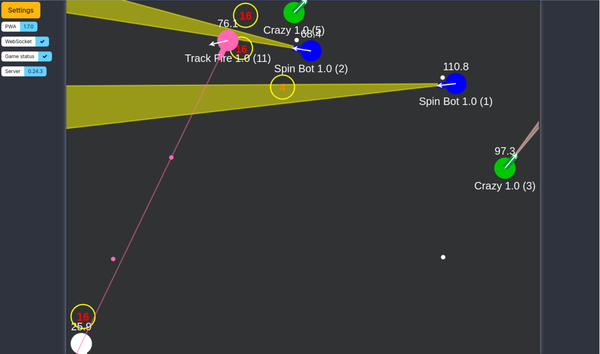

Robocode Tank Royale Observer implemented as PWA application.

It's built using:
- Node.js
- Express.js
- Pug
- plain JavaScript
- SCSS
- Bulma CSS framework

## Installation
1. Clone the repository
2. Run `npm install` in the root directory
3. Run `node app.js`

The application will be available at `http://localhost:8000` and `https://localhost:8443`

